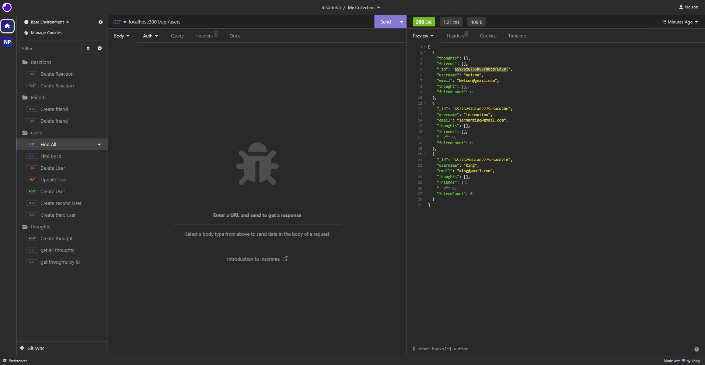

# Nelson's Social Networking

## Descryption

This is just an app made with express and mongoose in order to make different api calls to different routes.

## Table of Contents

1. [Installation](#installation)
2. [Usage](#usage)
3. [Credits](#credits)
4. [License](#license)
5. [Features](#features)
6. [How to Contribute](#contribute)
7. [Test](#test)
8. [Questions](#questions)

## Installation

Clone it from my Repo

## Usage

To use it you need to run the seed script and then run the start script. From there you can use insomnia to run the different api routes in localhost:3001

## Credits

https://shields.io/

## License

This application uses 

## Features

It uses Express, and MongooseDB

## How to Contribute

Contact me.

## Test

To test it you'll have to clone the repo, run the seed, start the server, and go into the localhost:3001 in insomnia.

## Questions

Github: [MartinezN2014](https://github.com/MartinezN2014)

Email: [Email](2014nmartinez@gmail.com)

Nelson's youtube tutorial on the SVG Logo
[Youtube](https://www.youtube.com/watch?v=cMaZdMeerH0)

